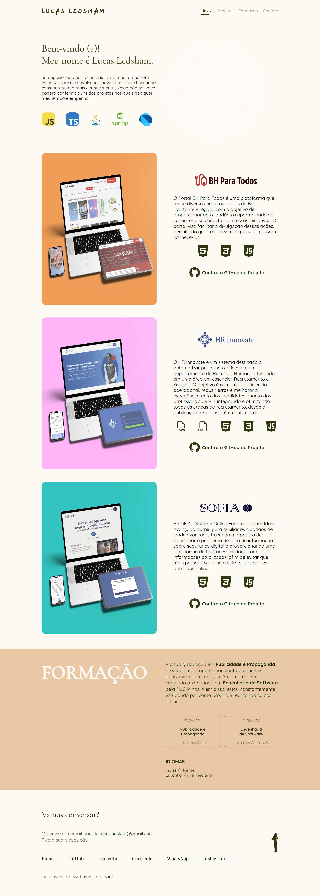
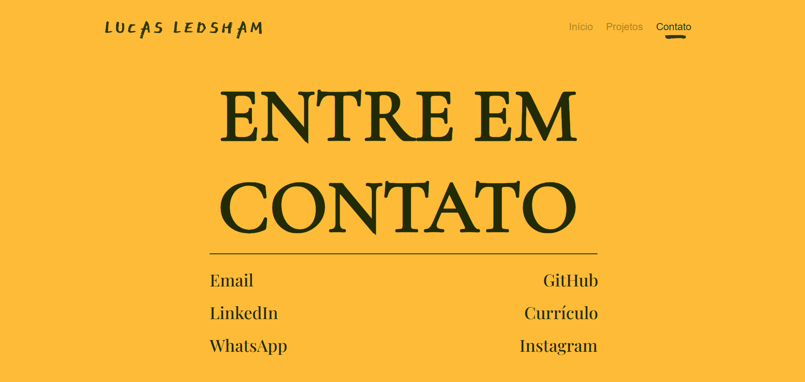

# 📌 Portfólio profissional Lucas Ledsham

## 📖 Descrição do Projeto
Este é um projeto de portfólio profissional criado para apresentar minhas habilidades, projetos desenvolvidos, formas de contato e outras informações relevantes sobre meu trabalho. 

## 🖼️ Protótipos
Adicione aqui imagens dos protótipos (wireframes, telas, diagramas, etc.).

Exemplo:  
  
  

## 🛠 Tecnologias Previstas
- [ ] **Frontend:** Descrever as tecnologias previstas (ex: HTML, CSS, JavaScript, React, etc.)
- [ ] **Backend:** Descrever as tecnologias previstas (ex: Node.js, Java, Python, etc.)
- [ ] **Banco de Dados:** Ex: MySQL, PostgreSQL, MongoDB, etc.
- [ ] **Outros:** Bibliotecas, APIs ou ferramentas extras.
